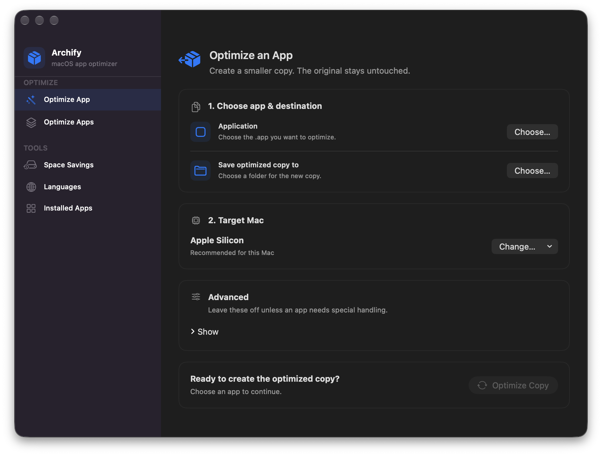

# Archify

Archify frees disk space by removing code your Mac never runs. Many macOS apps ship as universal binaries that contain both Apple Silicon and Intel code; Archify keeps only the architecture your Mac needs, stores what remains compressed, and can also remove unused language files.

## Requirements

- macOS 12 Monterey or later
- Apple Silicon or Intel Mac (Archify itself is universal)

## Installation

1. Download the latest `Archify-<version>.zip` from [Releases](https://github.com/Oct4Pie/archify/releases).
2. Unzip it and move **Archify** to your Applications folder.
3. Open Archify.

Releases are signed with a Developer ID and notarized by Apple. From 1.5 on, Archify updates itself; you can change this under **Archify → Settings → Updates**. If you are on 1.4 or earlier, install 1.5 manually once.

## Features

- **Optimize App** — creates a smaller copy of one app in a folder you choose. The original is never changed. If an app with the same name already exists there, you can keep both or replace the old one (it goes to the Trash).
- **Optimize Apps** — scans /Applications and ~/Applications, shows how much each app can save, and optimizes the apps you select in place.
- **Space Savings** — estimates how much space selected apps would free, without changing anything.
- **Languages** — removes language files for languages you don't use. Your preferred languages, each app's development language, and any language an app's signature depends on are always kept.
- **Installed Apps** — browse your apps by architecture: universal, Apple Silicon, Intel, or other.

Optimized binaries are stored with macOS's built-in transparent compression, the same format Apple's installers use. Apps read them unchanged, so signatures stay valid, and the binaries typically take a third to half of their thinned size on disk. Sizes and savings are shown as actual space on disk.

Long scans and batch operations can be paused, resumed, or canceled. If an app you are about to change is open, Archify offers to quit it first or skips it.

## How Archify keeps apps working

- **All or nothing.** Each app is optimized as a single transaction. New binaries are prepared and checked first, then swapped in atomically. If anything fails, the app is rolled back to exactly how it was.
- **Signatures stay valid.** Files that an app's signature seals are left alone, and the whole app is verified after the change. If verification fails, the change is undone. Optimized apps stay signed and notarized.
- **No surprises.** Optimize App only ever changes the copy, and nothing is overwritten without asking.

## Permissions

Apps in /Applications belong to the system, so Archify uses a small helper to change them:

- **Helper.** The first time you change an app in /Applications, macOS asks you to allow Archify in the background. Archify opens **System Settings → General → Login Items** for you and continues once you approve. The helper runs only while it has work to do.
- **Administrator password.** Every change in /Applications needs an administrator's approval, just as it would in Finder. The approval is reused for five minutes.
- **Full Disk Access (macOS 13 and later).** macOS protects apps that have been opened at least once. To change one of them, Archify needs Full Disk Access. Archify asks only when macOS actually blocks a change, and links straight to the right setting. App Management alone is not enough, because the helper acts for all users of the Mac.

Apps in ~/Applications belong to you and need none of these.

The helper can do only two things: optimize an app in /Applications and remove a language folder inside one. It accepts requests only from Archify signed by the same developer, checks every path without following symbolic links, and never leaves the app it was asked to change.

## Advanced options

Under **Advanced** in Optimize App:

- **Open the copied app once before optimizing** lets the copy finish its first-launch setup.
- **Use arm64e target** keeps the arm64e code instead of arm64. Use it only when the app contains an arm64e slice.
- **Signature handling** is **Preserve signature** by default. **Re-sign locally** (ad-hoc) and **Use LDID** are for an app that will not open after optimizing. Re-signing changes the app's identity and can affect Keychain access, updates, or copy protection, so use them only when needed. **Use LDID** needs [`ldid`](https://formulae.brew.sh/formula/ldid), for example from `brew install ldid`.

## Command-line tool

`archify.py` offers the same safe, transactional optimization from Terminal. It always works on a copy and never overwrites an existing app.

    python3 archify.py -app APP [APP ...] [-o OUTPUT_DIR] [-arch ARCH]
                       [-ld LDID] [-Ns] [-Ne] [-cs] [-l] [-Nc]

| Option | Meaning |
| --- | --- |
| `-app`, `--app_dir` | One or more apps to copy and optimize |
| `-o`, `--output_dir` | Folder for the optimized copies |
| `-arch`, `--arch` | Architecture to keep (default: this Mac's, even under Rosetta) |
| `-ld`, `--ldid` | Path to an `ldid` executable |
| `-Ns`, `--no_sign` | Don't sign with `ldid` |
| `-Ne`, `--no_entitlements` | Don't reuse entitlements when signing |
| `-cs`, `--codesign` | Ad-hoc sign the copy with `codesign` |
| `-l`, `--no_launch` | Don't launch the copy before optimizing |
| `-Nc`, `--no_compress` | Don't compress the thinned binaries |

Example:

    python3 archify.py -app "/Applications/Example.app" -o "$HOME/Desktop/Archified" -Ns -l

## Known limitations

- Some apps check their own files for changes, use copy protection, or ship their own updaters, and may object to an optimized copy even though macOS accepts its signature. Optimize a copy first if you are unsure.
- A self-updating app may restore the removed architecture or languages when it updates.

## Building from source

Open `archify.xcodeproj` in Xcode, or build and test from Terminal:

    xcodebuild -project archify.xcodeproj -scheme archify -configuration Debug build
    xcodebuild -project archify.xcodeproj -scheme archifyTests test
    python3 -m unittest discover -s tests -p 'test_*.py'

Debug builds are ad-hoc signed and do everything except install the privileged helper, which only trusts apps signed by the release team. To test the helper with your own Apple team, use `ARCHIFY_DEBUG_TEAM_ID=<team id> scripts/build-privileged-debug.sh`. Release builds are produced with `scripts/build-release.sh`.

## Changelog

See [CHANGELOG.md](CHANGELOG.md).

## License

Archify is licensed under the [GPLv3](https://choosealicense.com/licenses/gpl-3.0). Third-party notices are in [THIRD_PARTY_NOTICES.md](THIRD_PARTY_NOTICES.md).
